## 1. 扩展之NULL

当我们在定义一个指针的时候，经常用NULL来给指针赋初值，同时在应用指针的时候也会用NULL来进行指针内容的判断，那NULL究竟是什么？下面一起来探讨下。

### 4.1 NULL定义

NULL不是C语言的关键字，它是一个宏，定义如下：在C++中NULL等同于0，在C语言中NULL表示void *类型的0，其实本质还是0。

```c
#ifdef _cplusplus
#define NULL 0
#else
#define NULL (void *)0
#endif
```

### 1.2 NULL使用

如上面介绍，NULL的使用惯例是为指针赋初值，代表着指针指向0x0000，通常在内存的区域划分中，以0x0000为基地址的区域是一个受保护的区域，一般程序无法访问去篡改其中的数值，所以将这个基地址赋值给新定义的指针，可以保证这个指针不会胡乱指向别的空间篡改了数值造成程序错误，如果不给指针赋初值，那这个定义的指针就叫做`野指针`，野指针可以指向内存任意地址空间，在程序运行中会造成无法预料的问题：

```c
int *p = NULL;                      //定义int型指针p，并赋值NULL
p = (int *)malloc(sizeof(int)*5);   //为指针p分配20字节空间
if(NULL == p)                       //判断p是否为0
```

注意上面用NULL来判断p是否为0的时候，写成`NULL == p`而不是`p == null`，这是为了防止我们疏忽将判断等式写成了赋值表达式`p = NULL`，程序在编译过程中是不会报错出警告的，这就加重了调试的困难度。

### 1.3 NULL比较

既然NULL表示0，为了同其他字符以示区分，这边来对如下字符进行比较：

```c
'\0'：是一个转义字符，对应ASCII码的值是0(十进制)，本质是0；
'0'：是一个字符，对应ASCII码的值是48(十进制)，本质是48；
0：是一个数字0，本质就是0；
NULL：是一个表示式，是强制类型转换为void *类型的0，本质也是0。
```

总结： 
- '\0'用法是C语言字符串的结尾标志，一般放在字符串最后，用来判断字符串是否已经结束；
- '0'是字符0，一般用来获取0对应的ASCII码值；
- 0是数字0，用来判断int类型的变量是否为0；
- NULL是一个表达式，一般用来比较指针是否为野指针。

## 2. 扩展之强制类型转换

程序中经常使用强制类型转换将不同类型的变量转换成我们需要的类型变量，那类型转换在内存中如何体现呢？通过下面的例子来看下：

```c
#include<stdio.h>
int main(void)
{
    float a = 12.34;
    int b = (int)a;
    printf("b = %d\n",b);
    printf("a = %f\n",a);
    return 0;
}
```

程序执行结果：b = 12, a = 12.34

很简单的示例，通过将float型变量a强制转换成int型后赋值给变量b，思考下程序已经对a做了强制转换，为什么打印出来a的值还是12.34呢？再来看一个例子：

```c
#include<stdio.h>
int main(void)
{
    int a = 10;
    int b = 3;
    float d = 0;
    d = (float)a/b;
    printf("d = %f\n",d);
    return 0;
}
```

程序执行结果：d = 3.0000

结果为什么是3.0000而不是3.3333呢？



如图介绍，在内存中类型转换并不是一步完成的，而是分成了4步来完成：

- 第一步：在栈区创建一个临时变量x，类型与d的类型一致，也是float型；
- 第二步：因为a和b的类型都是int型，所以a/b的结果也是int型取整为数值3，将3赋值给临时变量x；
- 第三步：将临时变量x的值赋给变量d，因为是float型，所以要取四位小数，所以d的值为3.0000；
- 第四步：在栈区销毁临时变量x。

总结：当对一个变量或表达式进行强制类型转换，内存中会创建一个临时变量来存储计算后的数值，并将这个数值赋给对应的变量，而内存中实际存储的值并没有进行改动，程序执行完会自动销毁这个临时变量。

## 3. 扩展之DEBUG宏

### 3.1 DEBUG宏意义

DEBUG宏在软件DEBUG版本和RELEASE版本上应用较多，通常DEBUG版本打印出错log定位问题，而在RELEASE版本发布中则不需要此类log，因为程序在进行log打印的时候会占用很多系统资源，拖慢操作系统运行效率，因此DEBUG版本的代码效率是远远低于RELEASE版本的。

### 3.2 DEBUG宏实现原理

DEBUG宏简单的实现原理如下：

```c
#define DEBUG   //确认是否需要注释
#ifdef DEBUG
#define dbg() printf()
#else   
#define dbg() 
#endif
```

DEBUG版本和RELEASE版本控制区分是通过`#define DEBUG`这个宏定义来区分的，这个宏定义是程序员自己定义的，当程序编译DEBUG版本进行代码调试时，需要提前加上此宏定义，而后代码中的所有dbg()语句都会替换成printf()语句，将log信息按照dbg函数中预先设置好的格式打印出来；而当编译RELEASE版本时，则需要注释掉此宏定义，代码中的dgb()语句会全部替换成空，所有的log信息均不打印。

### 3.3 DEBUG宏实际应用

```c
#define DEBUG
#ifdef DEBUG    
#define DBG(...) /    
do{ /    
    fprintf(stdout, "[DEBUG  ]%s %s(Line %d): ",__FILE__,__FUNCTION__,__LINE__); /    
    fprintf(stdout, __VA_ARGS__); /    
}while(0)    
#else    
#define DBG(...)    
#endif 

#define ERROR(...) /    
do{ /    
    fprintf(stderr, "[ERROR  ]%s %s(Line %d): ",__FILE__,__FUNCTION__,__LINE__); /    
    fprintf(stderr, __VA_ARGS__); /    
}while(0)    

#define WARNING(...) /    
do{ /    
    fprintf(stdout, "[WARNING]%s %s(Line %d): ",__FILE__,__FUNCTION__,__LINE__); /    
    fprintf(stdout, __VA_ARGS__); /    
}while(0)    

#define INFO(...) /    
do{ /    
    fprintf(stdout, "[INFO  ]%s %s(Line %d): ",__FILE__,__FUNCTION__,__LINE__); /    
    fprintf(stdout, __VA_ARGS__); /    
}while(0)    

#define SHOW_TIME(...) /    
do{ /    
    extern unsigned long long gLatestTime;/    
    timeval tp;/    
    gettimeofday(&tp, NULL);/    
    unsigned long long now = tp.tv_sec*1000000+tp.tv_usec; /    
    if(gLatestTime != 0) /    
    { /    
        fprintf(stdout, ">>>>>>>>>Used Time: %s[%d], %s: %ld.%ld, %llu ms ", __FILE__, __LINE__, __func__, tp.tv_sec, tp.tv_usec, (now-gLatestTime)/1000);/    
        fprintf(stdout, __VA_ARGS__); /    
        fprintf(stdout, "/n"); /    
    } /    
    gLatestTime = now;/    
}while(0)    
```

上方示例中实现方式与原理介绍中的一样，对于编译DEBUG版本，需要添加`#define DEBUG`，代码中会将DBG()、ERROR()、WARNING()、INFO()、SHOW_TIME()替换成对应的格式打印出来；而编译发布RELEASE版本时，则注释掉`#define DEBUG`，则这些打印语句会被替换成空，所有的log都不会被打印。

## 4. 扩展之可变参函数

### 4.1 可变参函数说明

C语言中很多函数在定义时使用了可变参，可变参顾名思义表示函数的参数个数是不定的，程序员在使用这些函数时就可以根据需要来进行传参设定。通过man手册来看下printf函数的定义，如下：

```c
int printf(const char *format, ...);
```

参数format表示格式字符串的指令，是一个确定的参数，因为函数至少需要一个固定的参数；`...`表示可选参数，调用时传递给`...`的参数可有可无，根据实际情况而定。

### 4.2 实现可变参函数

要实现一个可变参函数需要使用到头文件`stdarg.h`中定义的这些函数：

- 可变参数函数定义

```c
typedef char * va_list;                  //在strarg.h头文件中定义，表示指向个数可变的参数列表指针的一种类型
void va_start(va_list ap, last);         //va_start()使参数列表指针ap指向参数列表中的第一个可选参数，last是可变参数`...`之前的最后一个固定参数
type va_arg(va_list ap, type);           //返回参数列表中指针ap所指的参数，返回类型为type，并使指针ap指向参数列表中下一个参数
void va_copy(va_list dest, va_list src); //dest，src的类型都是va_list，va_copy()用于复制参数列表指针，将dest初始化为src
void va_end(va_list ap);                 //清空参数列表，并置参数指针ap无效
```

注意：指针ap被置无效后，可以通过调用va_start()、va_copy()恢复ap，每次调用va_start()或者va_copy()后，必须得有相应的va_end()与之匹配；参数指针可以在参数列表中随意的来回移动，但必须在va_start() ~ va_end()之内。

- 可变参数宏定义

```c
#define _INTSIZEOF(n) ((sizeof(n) + sizeof(int) - 1) & ~(sizeof(int) - 1))    //求变量占用内存空间大小，便于代码移植
#define va_start(ap,v) (ap = (va_list)&v + _INTSIZEOF(v))                     //第一个可选参数地址
#define va_arg(ap,t) (*(t *)((ap += _INTSIZEOF(t)) - _INTSIZEOF(t)))          //返回当前参数，并指向下一个参数地址
#define va_end(ap) (ap = (va_list)0)                                          //将指针置为无效
```

以int TestFunc(int n1, int n2, int n3, …)为例子，来看参数传递时的内存堆栈实际情况：


1. 通过va_start得到第一个可选参数的地址：

```c
&n3 + _INTSIZEOF(n3)    //最后一个固定参数的地址 + 该参数占用内存的大小
```

2. va_arg身兼二职：返回当前参数，并使参数指针指向下一个参数：

```c
#define va_arg(ap,t) (*(t *)((ap += _INTSIZEOF(t)) - _INTSIZEOF(t)))
/* 指针ap指向下一个参数的地址 */
1．  ap += _INTSIZEOF(t)
/* ap减去当前参数的大小得到当前参数的地址，再强制类型转换后返回它的值 */
2．  return *(t *)( ap - _INTSIZEOF(t))
```

注意：函数的固定参数部分，可以直接从函数定义时的参数名获得；对于可选参数部分，先将指针指向第一个可选参数，然后依次后移指针，根据与结束标志的比较来判断是否已经获得全部参数。因此，va函数中结束标志必须事先约定好，否则指针会指向无效的内存地址，导致出错。

- _INTSIZEOF宏介绍

```c
#define _INTSIZEOF(n) ((sizeof(n) + sizeof(int) - 1) & ~(sizeof(int) - 1)) 
```

对于指针在可变参之间的偏移量，也就是上一个可变参和下一个可变参在内存空间的间隔大小是不确定的，这里涉及到内存对齐的问题，而_INTSIZEOF宏是就是为了此问题，内存对齐跟硬件平台有很大的关系，_INTSIZEOF(n)最终大小肯定是sizeof(int)的整数倍。

## 5. 扩展之预定义宏

## 6. 扩展之inline函数