## 1. 什么是socket(套接字)

### 1.1 socket背景

*在计算机通信领域，Socket被翻译为“套接字”，它是计算机之间进行通信的一种约定或一种方式。通过socket这种约定，一台计算机可以接收其他计算机发送的数据，也可以向其他计算机发送数据。还有一个概念叫描述符fd（file descriptor）, 或者叫句柄，从字面上可能不太好理解，但对比生活中耳熟能详的刀柄（刀把手，用来把控刀的使用）、门柄（门把手，可以控制门的开关）就不难理解了。*

*Socket起源于Unix，而Unix/Linux基本思想之一就是“一切皆文件”，都可以用“打开（open） –> 读写（write/read） –> 关闭（close）”模式来操作。Socket就是该模式的一个实现：即Socket是一种特殊的文件，一些Socket函数就是对其进行的操作（读/写IO、打开、关闭）。Socket函数返回一个整型的Socket描述符（句柄），随后的连接建立、数据传输等操作都是通过控制句柄来实现的。*

### 1.2 socket()

- 函数定义：

```c
int socket(int domain,int type, int protocol);
```

- 参数：

```c
domain:      /* 协议家族，包括AF（address family）地址族和PF（protocol family）协议族 */
type:        /* socket类型，也称传输方式，包含SOCK_STREAM\SOCK_DGRAM\SOCK_RAW */
protocol     /* 具体传输协议，如果不是定义的SOCK_RAW类型，则协议已经被决定好了，参数直接填0 */
```

- 常用的协议家族：

|Name|Purpose|
|:---:|:---:|
|AF_UNIX, AF_LOCAL|Local communication|
|AF_INET|Pv4 Internet protocols|
|AF_INET6 |IPv6 Internet protocols|

 *注意：PF协议族用法和AF是一样的，PF_INET等价于AF_INET，PF_INET6等价于AF_INET6*

- 协议家族结构体：

a. 通用的地址结构(sockaddr)

```c
struct sockaddr
{
    sa_family_t sa_family;     /* 2 bytes address family */
    char sa_data[14];          /* 14bytes of protocol address */
}；
```

b. AF_INET协议家族的地址结构(sockaddr_in)

```c
struct sockaddr_in
{
    sa_family_t    sin_family; /* address family： 2bytes*/
    in_port_t      sin_port;   /* port in network byte order: 2bytes*/
    struct in_addr sin_addr;   /* internet address: 4bytes*/
    char ext[8];               /* 8bytes */
};
/* Internet address */
struct in_addr
{
    uint32_t s_addr;           /* address in network byte order */
};
```

- 传输方式\套接字类型：

  - SOCK_STREAM：流格式套接字，使用了TCP协议，是一种可靠的、双向的通信数据流，数据可以准确无误地到达另一台计算机，如果损坏或丢失，可以重新发送。

  - SOCK_DGRAM：数据报格式套接字，使用了UDP协议，计算机只管传输数据，不作数据校验，如果数据在传输中损坏，或者没有到达指定计算机，是没办法补救的，也就是说，数据错了就错了，无法重传；因为数据报套接字所做的校验工作少，所以在传输效率方面比流格式套接字要高。

- 返回值：

  - 正确：返回一个int型的文件描述符，一个指向内部数据结构的指针，它指向描述符表入口，指引其他函数操作。

  - 失败：返回-1，即INVALID_SOCKET。

- 创建socket：

```c
int sockfd = socket(AF_INET, SOCK_STREAM, 0);      /* 创建TCP套接字 */
int sockfd = socket(AF_INET, SOCK_DGRAM, 0);       /* 创建UDP套接字 */
```

- 定义并配置结构体：

```c
struct sockaddr_in server_addr;                    / *定义结构体 */
bzero(&server_addr,  sizeof(struct sockaddr_in));  / *结构体初始化 */
server_addr.sin_family = AF_INET;                  / *设置TPv4地址族 */
server_addr.sin_port = htons(SERVERPORT);          / *设置端口号 */
server_addr.sin_addr.s_addr = htonl(INADDR_ANY);   / *设置任意IP地址都可以被监听 */
```

*注意：在设置端口号和IP地址时，使用了htons和htonl函数，这两个函数被包含在Linux系统/home/include/netinet/in.h下，htons函数和htonl函数将在章节三介绍。*

## 2. 常用函数接口

### 2.1 bind函数

- 函数介绍：

将一个创建好的socket和一个IP绑定,成功返回0，失败返回-1,bind函数用于服务器端，客户端无需绑定。

- 函数定义：

```c
int bind(int sockfd, const struct sockaddr *addr, socklen_t addrlen);
```

- 参数：

```c
sockfd:          /* 服务器中创建好的socket函数返回的描述符 */
addr:            /* 指定了想要绑定的IP和端口号，均要使用网络字节序-即大端模式（章节三介绍） */
addrlen：        /* sockaddr结构体长度，与sockaddr_in等价，均为16bytes */
```

### 2.2 listen函数

- 函数介绍：

将一个socket标记为被动套接字，不能主动发送请求，只能接收请求，listen函数用于服务器端，成功返回0，失败返回-1。

- 函数定义：

```c
int listen(int sockfd, int backlog);
```

- 参数：

```c
sockfd:          /* 服务器中创建好的socket函数返回的描述符
backlog:         /* 表示等待连接队列的最大长度，这个数值需要设定 */
```

### 2.3 accept函数

- 函数介绍：

获取客户端的请求，用于和客户端进行数据传输，accept函数用于服务器端，成功返回一个新的socket文件定位符（需要提前定义新的socket句柄来保存），失败返回-1。

- 函数定义：

```c
int accept(int sockfd, struct sockaddr *addr, socklen_t *addrlen);
```

- 参数：

```c
sockfd:          /* 服务器中提前定义用来保存新的socket文件定位符 */
addr:            /* 用于存放客户端的IP和端口号，均要使用网络字节序-即大端模式（章节三介绍） */
addrlen：        /* sockaddr结构体长度，与sockaddr_in等价，均为16bytes */
```

### 2.4 connect函数

- 函数介绍:

connect函数用于客户端向服务器发起TCP连接，成功返回0，失败返回-1。

- 函数定义:

```c
int connect(int sockfd, const struct sockaddr *addr, socklen_t addrlen);
```

- 参数:

```c
sockfd:          /* 客户端中创建好的socket函数返回的描述符 */
addr:            /* 用于存放想要连接的服务器的IP和端口号，均要使用网络字节序-即大端模式（章节三介绍） */
addrlen：        /* sockaddr结构体长度，与sockaddr_in等价，均为16bytes */
```

### 2.5 recv函数

- 函数介绍:

作用于服务器和客户端来接受对方发送的数据，失败返回-1。

- 函数定义:

```c
int recv(int sockfd, const char *buf, int len, int flags);
```

- 参数:

```c
sockfd:          /* 服务器和客户端中创建好的socket函数返回的描述符 */
buf:             /* 指明一个缓冲区用来存放接收到数据 */
len：            /* 指明缓冲区buf的长度 */
flags:           /* 无特别标识，一般设为0 */
```

### 2.6 send函数

- 函数介绍:

作用于服务器和客户端来发送缓冲区里指定的数据，失败返回-1。

- 函数定义:

```c
int send(int sockfd, const char *buff, int len, int flag);
```

- 参数:

```c
sockfd:          /* 服务器和客户端中创建好的socket函数返回的描述符 */
buf:             /* 指明一个缓冲区用来存放要发送的数据 */
len：            /* 指明缓冲区buf的长度 */
flags:           /* 无特别标识，一般设为0 */
```

### 2.7 read函数

- 函数介绍：

read函数会把参数fd所指的文件内传送count个字节到buf指针所指的内存中。需要读取的数据如果不超过指定长度的时候有多少则读取多少，数据不够会一直等待，所以当fd内的数据少于需要读取的数据时会发生阻塞；如果fd内数据大于要读取的数据则只会读取指定字节长度的数据。

```c
#include <unistd.h>
ssize_t read(int fd, void *buf, size_t count);
```

- 参数：

```c
fd：socket创建文件描述符，可以理解为读取数据的通道
buf：需要读取的数据，这边通常定义为一个字符串数组
count：需要读取数据的字节数
```

- 返回值：

执行成功会返回实际读取的字节数，执行失败时返回-1，错误代码会存入errno中，根据不同的errno解析失败原因。

### 2.8 write函数

- 函数介绍：

write函数会把参数buf所指的内存数据写入count个字节到参数fd所指的文件内。在socket通信中write函数是将数据写入描述符缓冲区，缓冲区内的数据什么时候发出去或者对方主机什么时候接收、读取，write函数不会关心。

通常，发送端收到接收端的ACK应答后，内核进程会在发送端缓冲区清理一部分数据留出空间，为便后续write函数继续发送数据；但当接收端进程读取数据不及时导致发送端缓冲区无法腾出有效空间，则进程管理会阻塞write函数发送后续数据。

```c
#include <unistd.h>
ssize_t write(int fd, const void *buf, size_t count);
```

- 参数：

```c
fd：socket创建文件描述符，可以理解为发送数据的通道
buf：需要发送的数据，这边通常定义为一个字符串数组
count：需要发送数据的字节数
```

- 返回值：

执行成功会返回实际写入的字节数，执行失败时返回-1，错误代码会存入errno中，根据不同的errno解析失败原因。

### 2.9 close函数

- 函数介绍:

关闭创建的套接字，成功返回0，失败返回-1。

- 函数定义:

```c
int close(int sockfd);
```

- 参数:

```c
sockfd:          /* 服务器和客户端中创建好的socket函数返回的描述符 */
```

*注意：执行close函数断开socket连接有优雅断开和强制断开两种方式，要设置断开方式需要配置setsockopt函数的SO_LINGER，详细说明参考“Linux C函数 3.1节。*

## 3. 网络字节序、主机字节序、大端、小端

### 3.1 主机字节序

不同的CPU有不同的字节序类型，这些字节序是指整数在内存中保存的顺序，这个叫做主机字节序，存储方式有2种：

- 大端模式

```c
大端模式(Big-Endian)就是高位字节排放在内存的低地址端(即该值的起始地址)，低位字节排放在内存的高地址端。
```

- 小端模式

```c
小端模式(Little-Endian)就是低位字节排放在内存的低地址端(即该值的起始地址)，高位字节排放在内存的高地址端。
```

- 常见的CPU储存方式

```c
小端存储的CPU有：Intel x86、ARM
大端存储的CPU有：Power PC、MIPS UNIX、HP-PA UNIX
```

### 3.2 网络字节序

网络字节顺序是TCP/IP中规定好的一种数据表示格式，它与具体的CPU类型、操作系统等无关，从而可以保证数据在不同主机之间传输时能够被正确解释，网络字节顺序采用大端(big endian)排序方式。

- 为什么网络字节序是大端模式？

网络上传输的数据都是字节流，对于一个多字节数值，在进行网络传输的时候，先传递哪个字节？也就是说，当接收端收到第一个字节的时候，它将这个字节作为高位字节还是低位字节处理？ UDP/TCP/IP协议规定：把接收到的第一个字节当作高位字节看待，这就要求发送端发送的第一个字节是高位字节；而在发送端发送数据时，发送的第一个字节是该数值在内存中的起始地址处对应的那个字节，也就是说该数值在内存中的起始地址处对应的那个字节就是要发送的第一个高位字节(即：高位字节存放在低地址处)；由此可见，多字节数值在发送之前，在内存中应该是以大端模式存放的，所以网络字节序是大端字节序。比如,我们经过网络发送整型数值0x12345678时,在X86平台中,它是以小端发存放的,在发送之前需要使用系统提供的字节序转换函数htonl()转换成大端模式存放的数值:



### 3.3 转换函数

- htons： 把unsigned short类型从主机序转换到网络序；
- htonl： 把unsigned long类型从主机序转换到网络序；
- ntohs： 把unsigned short类型从网络序转换到主机序；
- ntohl： 把unsigned long类型从网络序转换到主机序；

## 4. socket通信流程图



## 5. socket通信扩展之select函数

### 5.1 select函数介绍

*实现服务器和多组客户端同时通信，就要用到select这个API，它是IO多路复用一种常见方式，IO多路复用解决了多线程并发的问题（CPU占用率高），却也能实现同时处理多组客户端的需求，当然还有其他方式（poll、epoll），这边只做select介绍。通过man手册，可以查到select函数的头文件、定义、参数等：*

- 头文件

```c
#include <sys/select.h>
#include <sys/time.h>
#include <sys/types.h>
#include <unistd.h>
```

- 函数定义

```c
int select(int nfds, fd_set *readfds, fd_set *writefds,fd_set *exceptfds, struct timeval *timeout);
```

- readfds：监视sd_set集中文件描述符是不是可读状态，准确的说是不是读取IO端口不堵塞了；

- writefds：监视sd_set集中文件描述符是不是可写状态，准确的说是不是写入IO端口不堵塞了；

- exceptfds：监视sd_set集中文件描述符是不是发生异常错误；

*注：select()函数允许程序监视多个文件描述符，等待所监视的一个或者多个文件描述符变为“准备好”的状态；这边”准备好“状态表示文件描述符不再是阻塞状态，可以进行IO操作了，包括可读(readfds)，可写(writefds)，发生异常(exceptfds)三种。*

Select是用来等待规定时间里集合内的fd状态改变的函数，例如客户端当前处在可读状态或者可写状态等，Select去做相应的处理并返回int类型的值，值小于0代表出错，等于0表明设定的时间超时了，大于0表明函数正确执行并成功返回；

Select函数里用到了两个结构体fd_set和timeval，通过man手册也可查询到详细的说明。

### 5.2 fd_set集

fd_set可以理解为数学概念上的一个集，这个集包含了FD_CLR、FD_ISSET、FD_SET、FD_ZERO宏对描述符进行操作：

- void FD_CLR(int fd, fd_set *fdset);

*注：对fdset中文件描述符fd的位清零，如假设fd_set为1byte，那就表示fd_set集中可以存储8组fd，FD_CLR的作用就是将fd_set中指定位清零*

```c
FD_CLR(client_fd[i],&server_fdset);    /* 使用参考:将server_fdset中client_fd[i]对应的位清零 */
```

- void FD_SET(int fd, fd_set *fdset);

*注：对fd_set中文件描述符fd的位置1，即将对应的fd放入集中*

```c
FD_SET(sockfd,&server_fdset);          /* 使用参考:将sockfd放入server_fdset中，sockfd对应的位置1 */
```

- void FD_ZERO(fd_set *fdset);

*注：对fd_set中所有文件描述符fd的位进行初始化，即将所有的位置0*

```c
FD_ZERO(&server_fdset);                /* 使用参考:对server_fdset进行初始化 */
```

- void FD_ISSET(int fd, fd_set *fdset);

*注：检测文件描述符集fdset中对应于文件描述符fd的位是否被设置*

```c
FD_ISSET(sockfd,&server_fdset);        /* 使用参考:判断server_fdset集中是否对sockfd进行了设置，即sockfd对应的位是否置1 */
```

### 5.3 timeval结构体

- 结构体定义--包含在<time.h>中

```c
struct timeval
{
    long tv_sec;    //设定秒
    long tv_usec;   //设定毫秒
};
```

- 结构体使用

```c
timeout.tv_sec = 30;                                /*设置检测时间为30s*/
timeout.tv_usec = 0;
...
...
if(value == 0)                                      /*30s检测不到客户端fd会打印消息*/
{
 printf("/***time out!***/\n");
 continue;
}
```

### 5.4 select函数使用

```c
int value = select(fd_num+1,&server_fdset,NULL,NULL,&timeout);
if(value < 0)
 {
  printf(stderr,"/***Select failed!***/\n");
  exit(EXIT_FAILURE);
 }
else if(value == 0)    //30s检测不到客户端fd会打印消息
 {
  printf("/***time out!***/\n");
  continue;
 }
else
 {
  if(FD_ISSET(0,&server_fdset))       //当客户端连接成功，通过标准输入，可以查询客户端fd
  {
   bzero(input_message,MAXSIZE);
   fgets(input_message,MAXSIZE,stdin);
   for(i=0;i<CLIENT_NUM;++i)
   {
    if(client_fd[i] != 0)
    {
     printf("client_fd[%d]=%d\n",i,client_fd[i]);
    }
   }
  }
  if(FD_ISSET(sockfd,&server_fdset))
  {
   int  sin_size = sizeof(struct sockaddr_in);
            client_sockfd = accept(sockfd, (struct sockaddr *)(&client_addr), &sin_size);
   if(client_sockfd > 0)
   {
    int flag = -1;
    for(i=0;i<CLIENT_NUM;++i)  //寻找client_fd数组中是否有剩余的空位存放客户端句柄
     if(client_fd[i] == 0)
     {
      flag = i;
      client_fd[i] = client_sockfd;
      break;
     }
    if(flag >= 0)
                    printf("/***success to add a new client[%d]***/\n",flag);
                else                      //当客户端超出服务器可接收的范围，会反馈无法加入的消息
    {
     char full_message[]="Client is full, can not join now!\n";
     bzero(input_message,MAXSIZE);
     strncpy(input_message,full_message,MAXSIZE);
     send(client_sockfd,input_message,MAXSIZE,0);
    }
   }
  }
 }
```

在使用select函数时，要清楚select向系统内核传递了哪些信息：

- 总计要监视的文件描述符个数。这里fd_num即为所要监控的最大文件描述符个数，但按照内核需求加1（nfds is the highest-numbered file descriptor in any of the three sets, plus 1）；

- 监视每个描述符的一种或多种状态，包括：可读，可写，发生异常三种。当前函数中设定监控fd是否从阻塞变成可读状态，不监控fd可写和异常状态；

- 等待监视的时间，因为监视是一个过程，可以设定内核监视多长时间，然后返回监视结果。当前代码监视30s，若超时会打印“time out!”;

*注：timeval时间设定不能放在while循环外面，需要放在while内部，每次执行select监视都需要对时间进行重设，保证充足的监视时间，如果将时间设定放在while外，则执行select时会进行时间时间累积，比如假设设置监视时间为30s，读取某个fd的可读状态花了15s，下一次再监视其状态只会监视15s便会返回结果，而不是按照设定的30s进行监视！*

- 返回结果：已准备的文件描述符个数，对于读、写、异常状态，分别是哪个文件描述符准备好了。当前代码中设定了返回值小于0时报错，等于0时代表时间超时，大于0时表示监视正常，某个fd可读状态准备好了，可进行读取信息。

### 5.5 select应用扩展

select函数可以充分利用参数timeval结构体来设置定时器的应用，也可以在线程内做延迟使用，fd数和fd_set都无需设定，如下：

```c
#include <stdio.h>
#include <sys/time.h>
int main()
{
 struct timeval tv;
 while(1)
 {
  tv.tv_sec = 1;                   /* 定时1秒 */
  tv.tv_usec = 0;
  switch(select(0, NULL, NULL, NULL, &tv))
  {
   case -1:                     /* 错误 */
          printf("Error!\n");
          break;
   case 0:                      /* 超时 */
          printf("timeout expires.\n");
          break;
   default:
          printf("default\n");
          break;
  }
 }
 return 0;
}
```

## 6. socket通信扩展之fork函数

*一个进程。包括代码、数据和分配给进程的资源。fork()函数通过系统调用创建一个与原来进程几乎完全相同的进程，也就是说把原来的进程归为父进程，创建出来的进程作为子进程，这两个进程可以做完全相同的事，但如果初始参数或者传入的变量不同，两个进程也可以做不同的事。*

首先我们先来看下例子：

```c
pid_t fpid;
fpid = fork();      /* 创建进程 */
if(fpid < 0)        /* 返回值小于0出错 */
{
    printf("error hanppened!\n");
}
else if(fpid == 0)  /* 返回值等于0表示当前为子进程 */
{
    printf("fpid is the child process!\n");
}
else                /* 返回值大于0表示当前为父进程 */
{
    printf("fpid is the parent process!\n");
}
```

从上面例子中可以看到，fork函数不需要传参，所以它本身的函数参数就是void，另外利用fork创建好进程后，系统会从一个进程变成2个进程，这时候就会有两组返回值，通过返回值可以判断当前是处于子进程还是父进程；pid_t类型实质上就是int类型，只是使用了typedef重新命名了。

fork函数的神奇之处在于，系统仅调用了一次fork，却有2个返回值，代表父进程和子进程。在子进程中，fork返回值为0；在父进程中，fork的返回值为子进程的ID（参考上述示例：fpid==0为子进程，fpid>0为父进程），当然也有第三个返回值，那就是error（fpid<0）。

理解了fork函数的大体意思，那我们就可以通过fork函数来实现服务器与多组客户端通信了，通信流程都是一致的。

不同之处在于，在使用accept函数接收客户端请求连接前，需要提前创建子进程，通过父进程循环接收不同客户端的连接请求，让子进程执行通信报文的收发，一个子进程对应一个客户端，当客户端退出通信时，子进程也会同时被关闭。

也就是说在accept函数之前创建子进程，后续的通信收发处理都在子进程中实现，父进程仅循环接收客户端请求并创建子进程来对接：

创建子进程过程如下：

```c
pid_t fpid;
fpid = fork();
if(fpid == 0)                /* 判断是否为子进程 */
{
 close(sockfd);           /* 子进程不需要监听sockfd，只需要处理newfd实现和客户端通信
 listen_data(newfd,i);    /* newfd表示接收到客户端而创建的新的句柄，i代表客户端编号 */
 exit(0);
}
```

*注意：创建的子进程在客户端结束通信时一定要关闭，否则冗余的进程会一直存在着，占用多高的CPU内存影响报文处理。*

当然fork函数的应用还有很多，涉及到的其他函数也有很多，譬如可以通过getpid和getppid函数来获取进程识别码，通过识别码也可以确认当前进程是父进程还是子进程，同时也可以通过识别码来创建临时文件。