## 1. static介绍

&emsp;&emsp;static是C语言的一个关键字，通常一个关键字只有一个含义，也就是一种用法，但static不同，它具有两种含义，且这两种含义相互之间没有任何关联。

- static修饰局部变量
- static修饰全局变量或函数

&emsp;&emsp;在介绍static功能之前，先来了解下内存存储区和其他相关概念，内存存储区大致可以划分为栈、堆、数据段、bss段、代码段这五部分。

### 1.1 栈(stack)

&emsp;&emsp;栈其实是一种数据结构，是系统管理内存的一种方式，C语言将局部变量(auto修改的变量，通常auto会省略，仅在语句块中使用)存储在栈上。

&emsp;&emsp;以下面例子来说明：假设栈空间大小为32K，栈空间为空时，Top指针和Bottom指针都指向地址0x0000，此时定义一个int型的局部变量a并赋值为4，因为int型变量占4个字节，则数值4就被存储在地址为0x0000 ~ 0x0003所代表的空间中，而Top指针向上移动指向0x0004；同理，再定义一个double型变量b并赋值为8.0000，则地址0x0004 ~ 0x000b所代表的空间存储着变量b的数值8.0000，Top指针继续向上移动到0x000c；在为变量a和变量b分配空间的时候，Top指针会随着空间的分配而移动，Bottom指针一直指向原始地址不变。

&emsp;&emsp;同样的，当释放double型局部变量b时，Top指针向下移动到地址0x0004，数值8.0000存储的空间就被系统释放，此时要记住，原先空间中存储变量b的数值并没有被清空（这就是下面要讲到的脏内存）；最后如果语句块代码执行结束，变量a的空间也会被释放，Top指针最终仍然指向原始地址0x0000。值得注意的是，在此过程中，要想释放变量a的空间就必须先释放变量b的空间，无法跳过变量b先释放变量a，这就像一个储物柜，先放进去的东西只能等到最后才能拿出来，这就是栈很重要的一个特点叫先进后出(FILO)，也可称为后进先出(LIFO)。



&emsp;&emsp;从上面流程分析中可以总结如下几点：

- **栈对于局部变量的空间分配是系统来分配的**：当程序员定义一个局部变量时，系统就会为这个变量自动分配一个空间；同理释放栈空间也是由系统自动回收的，无需程序员操作；
- **栈空间是被重复使用的**：栈空间由系统分配释放，所以随着语句块程序的执行和结束，栈空间会不停分配和释放，所以栈空间在代码执行过程中会被重复使用，实际的分配地址空间也是根据Top指针来随机分配的；
- **栈空间是脏内存**：由于栈空间的重复使用，原先空间中存放的数值并没有随着空间的释放而被清理，所以当我们定义一个局部变量时一定要对变量进行初始化，否则变量的值会因为脏内存而产生随机的值，不确定的值会增加程序的风险性；
- **栈空间大小是固定的**：不同于堆空间，栈空间大小是固定的，且容量一般较小，所以在定义布局变量时一般不建议占用较大的空间，容易引发段错误或造成数组溢出；
- **语句块不可返回局部变量或不可作用域外访问局部变量**：局部变量有其自身的作用域，当语句块代码执行结束超出局部变量作用域时，栈空间就被释放，此时从变量作用域外去访问此变量是有风险的，同时当语句块代码执行结束也不可返回此局部变量，因为存放该变量的地址空间已经被释放。

### 1.2 堆(heep)

&emsp;&emsp;系统内存的容量随着发展越来越大，管理也越来越复杂，因为系统内众多进程并行处理随时都可能申请或释放内存，而且申请的内存空间大小不定。在此之下就引出了堆，堆同栈一样，也是系统实现内存管理的一种方式，但与栈的差异较大。

&emsp;&emsp;通过下面例子进行说明：

```c
int *p = NULL;
p = (int *)malloc(sizeof(int)*25);
if(NULL == P)
    printf("heep memory application failed!\n");
else
    ...
free(p);
p = NULL;
```

&emsp;&emsp;示例中，我们定义了一个int型指针p，并赋值为NULL，同时在后面加了内存是否分配成功的判断(关于`NULL`的说明可参考[Main函数的思考](main.md)第4节)；堆内存的分配是用`malloc`函数来分配的，分配的内存大小是可以自己定义的，当前为变量p分配了100字节，另外除了malloc可以分配堆空间之外，还有另外同类函数也可以实现堆内存的分配：

```c
#include <stdlib.h>                        //使用堆内存分配函数必须包含的头文件
void *malloc(size_t size);                 //为指针变量ptr分配size大小的堆内存，这边void *类型会在内存分配中强制转换成相对应的类型
void *calloc(size_t nmemb, size_t size);   //为指针变量ptr分配nmemb个内存，每个内存大小为size，calloc函数与malloc的区别在于，calloc可以分配多个内存，总内存大小为nmemb*size
void *realloc(void *ptr, size_t size);     //为已分配的指针变量ptr重新分配size大小的内存，如果ptr是NULL，其功能相当于malloc
void free(void *ptr);                      //释放之前为指针变量ptr分配的内存
```

&emsp;&emsp;通过上面的例子及阐述，可以总结如下几点：

- **堆内存由malloc、calloc和realloc来分配**：堆内存只能用来储存由malloc、calloc和realloc函数分配的变量，其他变量不会存储到堆中，而且堆内存必须程序员自己申请自己释放；
- **堆内存分配后要对变量进行判断**：malloc等函数成功分配则返回指向这块内存的首地址，若分配失败则返回空指针NULL，所以在程序使用前一定要进行判断；
- **堆空间使用结束一定要释放内存**：堆内存空间较大，但也是有上限的，程序执行中会反复进行内存申请，如果不释放内存，已申请到的内存会被一直占用着，最终导致内存空间不足出现错误；
- **堆内存分配之前和释放之后为指针变量赋值NULL**：目的是避免野指针的出现，野指针表示可以指向任意地址的指针，此指针地址是不确定的，如果指针指向不可访问区域会引发段错误，如果指向其他地址空间，对指针赋值后会修改原先储存的值造成其他不可控的问题；
- **堆内存未释放之前勿堆内存首地址进行赋值**：目的为防止内存泄漏，也叫做内存丢失，这个丢失就是无法访问这块内存，因为指针被重新赋值后，原先的地址就被覆盖了，新的地址是指向另外的空间，原先的内存就丢失了，free函数也无法对内存进行回收；
- **堆内存分配的最小字节为24bytes(基于64位)**：通过如下示例说明

```c
//程序
#include<stdio.h>
#include<stdlib.h>
#include<malloc.h>
int main(void)
{
    int *p = NULL;
    int byte = 0,n = 0;
    printf("please input a unsigened number:");
    while(scanf("%d",&n)!='\0')
    {
        p = (void *)malloc(sizeof(int)*n);
        if(NULL == p)
            printf("malloc failed!\n");
        byte = malloc_usable_size(p);
        printf("byte's size is %d\n",byte);
    }
    free(p);
    p = NULL;
    return 0;
}

//结果
please input a unsigened number:6
byte's size is 24
3
byte's size is 24
2
byte's size is 24
7
byte's size is 40
10
byte's size is 40
50
byte's size is 200
15
byte's size is 72
```

&emsp;&emsp;总结：当对n输入0 ~ 6即申请的内存小于等于24bytes时,实际得到的内存都为24bytes，但当n的输入值大于6时，实际得到的内存会大于等于我们向堆申请的内存。也就是说malloc等函数向堆申请内存时，堆内存最低分配的字节时24bytes(32位为16bytes)，当申请的内存大于24bytes时，因为C语言的内存对齐，实际得到的内存会大于等于我们需求的内存。

&emsp;&emsp;另外在函数中，可以通过`malloc_usable_size`函数将堆实际分配的内存打印出来，如果ptr指向分配内存的首地址即malloc分配内存成功则函数返回实际得到的内存大小，如果ptr是空指针则返回0，函数定义如下：

```c
#include <malloc.h>
size_t malloc_usable_size (void *ptr);
```

### 1.3 代码段、数据段、bss段

&emsp;&emsp;一段可执行程序是由代码(函数)和数据(变量)这两部分组成的，这两部分在内存中存储方式根据处理器的结构有所差异。在哈佛结构中，代码和数据是分开储存的，程序的代码存储在内存中的代码段，因为一般可执行程序的代码是只读的，我们并不需要对代码进行修改，而数据存储在内存中的数据段，数据在可执行程序中是可读可写的，我们可以通过改变程序中的数据来执行程序得到不同的结果。而在冯.诺伊曼结构中，可执行程序的代码和数据都是存储在同一区域的，代码和数据是依次排列在内存中，程序的执行也是串行按照流水线运作的方式依次执行，效率较低，同时对数据的修改容易导致错误。这边划分的代码段、数据段和bss段都是基于哈佛结构：

- 代码段：用来存储程序中的代码，也就是我们通常写的函数；
- 数据段：用来存储程序中的数据也就是我们定义的变量，这个变量有两点要求：
  - 初始化不为0的全局变量；
  - 用static修饰的初始化不为0的局部变量。
- bss段：也用来存储变量，这变量与数据段中存储的变量的差异在于有没有初始化为0：
  - 初始化为0的全局变量；
  - 用static修饰的初始化为0的局部变量。

*注意：上面提到的全局变量和局部变量是指这个变量的作用域，全局变量的作用域表示当前文本皆有效，而局部变量的作用域表示仅在规定的代码块中有作用，代码块外不起作用。*

### 1.4 存储类、作用域、生命周期、链接属性

- 存储类：指的是变量在内存中存储的区域，如普通局部变量存储在栈上，malloc分配的内存存储在堆中，执行程序的代码存储在代码段中，全局变量存储在数据段或者bss段；
- 作用域：指的是变量在程序中的作用范围，如普通局部变量作用范围是单个代码块，全局变量作用范围是整个文本程序；
- 生命周期：指的是变量从定义到消亡的时间，如普通局部变量在程序执行代码块时被定义到代码块执行结束被消亡，而全局变量从程序刚运行时被定义到整个文本程序执行结束才会被消亡；
- 链接属性：程序在执行中简单被分为两步，编译+链接，编译是单个文件进行编译，由预处理器将头文件中的内容在程序中扩展开来，再由编译器进行编译，如果有问题会报编译错误或警告，最终生成.o的二进制文件；而链接是将多个.o的二进制文件进行链接起来，如果链接有问题会报链接错误或警告，最终生成可执行程序(linux下可执行程序没有固定的后缀名，主要是通过文件属性来区分是否可被执行，而window或dos系统下可执行程序有固定的后缀名，如.exe或.bat)。链接又分为外链接、内链接和无链接
  - 外链接：可以跨文件进行符号链接，即可以和多个文件进行链接，如普通的函数和全局变量就是外链接属性；
  - 内链接：只能在本文件内进行符号链接，不可和外部文件进行链接，如static修饰的函数和全局变量就是内链接属性；
  - 无链接：程序链接时不参与链接的符号，如auto和static修饰的局部变量都是无链接属性。

## 2. static修饰局部变量

&emsp;&emsp;static修饰的局部变量和普通的局部变量的主要区别在于存储类不同，普通的局部变量(auto关键字修饰)存储在栈上，由系统自己分配内存自己回收内存，而static修饰的局部变量存储在数据段和bss段上；两者生命周期也不同，普通局部变量的生命周期是临时的，随着代码块程序执行结束而被消亡，而static修饰的局部变量是全局的生命周期，随着整个程序执行结束才会消亡；static修饰的局部变量的作用域与普通局部变量一样，仅作用在代码块中；链接属性也一样都是无链接。

&emsp;&emsp;通过下方示例来进一步说明：

```c
//程序
#include<stdio.h>
int add(int a);
int test(int c);
int main(void)
{
    int a = 0;
    int c1, c2;
    c1 = add(a);
    printf("c1 = %d\n",c1);
    a = 2;
    c2 = add(a);
    printf("c2 = %d\n",c2);
    return 0;
}
int add(int a)
{
    static int c = 1;       //定义一个static局部变量
    c = test(a) + test(c);
    return c;
}
int test(int c)
{
    return c+c;
}
//结果
c1 = 2
c2 = 8
```

总结：
- static修饰的局部变量c初始化为1，表示这个变量存储在数据段；
- 从c2=8这个结果上看，static修饰的局部变量生命周期是全局的，并没有在执行c1结束后被消亡，所以在执行c2时c的值为2；
- 函数多次用到static局部变量的时候，初始化仅在第一次起作用，后续函数执行会跳过初始化，保留延续上一次执行得到的结果。

## 3. static修饰全局变量或函数

&emsp;&emsp;普通全局变量和函数是外链接属性，是可以被外部文件进行链接的，因此包含多个.c文件的工程内是不允许有函数和普通全局变量同名的，这会让链接器无法有效识别而导致报错，但一个工程项目很难由一个程序员独自完成，通常是一个团队多人协作共同来开发完成，这就很难保证大家对于函数和普通全局变量的取名不重复，其他高级语言可以通过命名空间(namespace)来有效解决这个问题，但C语言开发出来较早，为了解决这个问题，便规定了static第二种用法，即用static修饰函数和全局变量。

&emsp;&emsp;static修饰的函数和全局变量是内链接属性，仅在本文件内进行符号链接，外部.c文件无法进行符号链接，所以可以有效的解决同名问题，所以在写代码的时候，如果确定此函数和全局变量不需要对外链接，可以在定义时加上static，这样就不会担心由同名的问题出现，函数和全局变量的命名也更加自由。